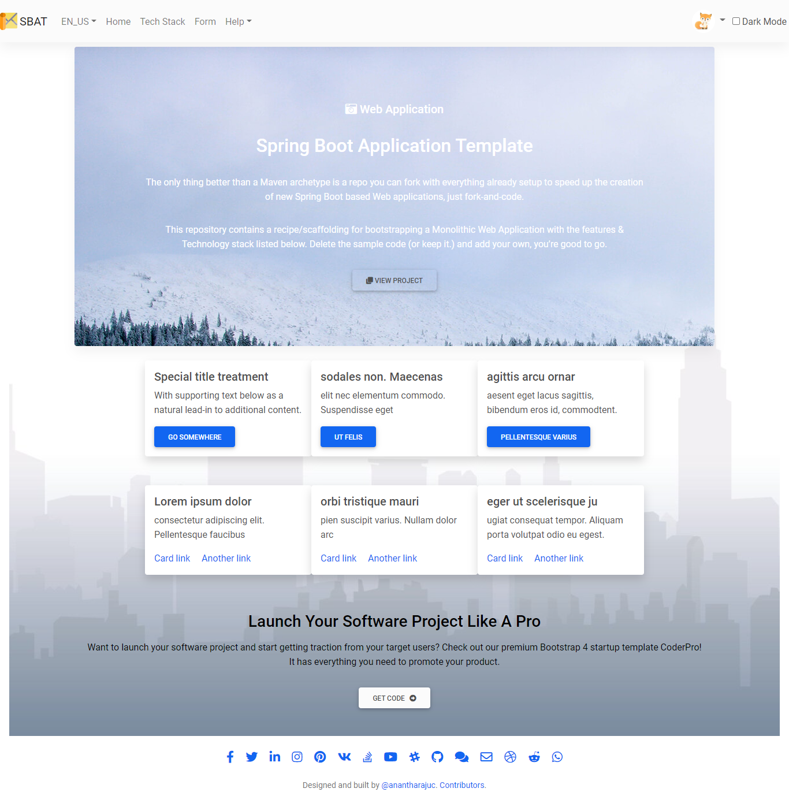

<!--
*** Thanks for checking out Spring Boot Application Template. If you have a suggestion
*** that would make this better, please fork the repo and create a pull request
*** or simply open an issue with the tag "enhancement".
*** Thanks again!
-->
# Spring Boot Application Template/Starter-Project [](https://travis-ci.org/github/AnanthaRajuC/Spring-Boot-Application-Template)

The only thing better than a Maven archetype is a repo you can fork with everything already setup to speed up the creation of new Spring Boot based Web applications, just fork-and-code.

This repository contains a **recipe/scaffolding** for bootstrapping a **Monolithic Web Application** with the features & Technology stack listed below. Delete the sample code (or keep it.) and add your own, you’re good to go.

Essentially it's a simple on-demand application backend for rapd-prototyping.

Features include but not limited to:

- [Authentication](documents/AUTHENTICATION.MD)  
- [User Profiles](documents/USER_PROFILES.MD)   
- [User Roles](documents/USER_ROLES.MD)   
- [API](documents/API.md)  
- [Internationalization (i18n)](documents/INTERNATIONALIZATION.MD) 

<div align="center">

[](https://gitter.im/spring-boot-application-template/community?utm_source=badge&utm_medium=badge&utm_campaign=pr-badge)
</div>

<div align="center">

[](CODE_OF_CONDUCT.md) [](https://twitter.com/intent/tweet?text=Checkout+this+recipe+for+bootstrapping+a+%40springboot+based+monolithic+web+application&url=https://github.com/Spring-Boot-Framework/Spring-Boot-Application-Template&hashtags=SpringBoot) [](https://twitter.com/anantharajuc)
</div>

<div align="center">
  <sub>Built with ❤︎ by <a href="https://twitter.com/anantharajuc">Anantha Raju C</a> and <a href="https://github.com/Spring-Boot-Framework/Spring-Boot-Application-Template/graphs/contributors">contributors</a>
</div>

</br>

<p align="center">
	<a href="https://github.com/Spring-Boot-Framework/Spring-Boot-Application-Template/blob/master/README.md#spring-boot-application-templatestarter-project-"><strong>Explore the docs »</strong></a>
	<br />
	<br />
	<a href="https://github.com/Spring-Boot-Framework/Spring-Boot-Application-Template/issues">Report Bug</a>
	·
	<a href="https://github.com/Spring-Boot-Framework/Spring-Boot-Application-Template/issues">Request Feature</a>
</p>

<!-- PROJECT SHIELDS -->
<!--
*** I'm using markdown "reference style" links for readability.
*** Reference links are enclosed in brackets [ ] instead of parentheses ( ).
-->

|     Service     | Badge | Badge | Badge | Badge | Badge |
|-----------------|-------|-------|-------|-------|-------|
|  **GitHub**     |[](https://github.com/Spring-Boot-Framework/Spring-Boot-Application-Template/commits/master)|[](https://github.com/Spring-Boot-Framework/Spring-Boot-Application-Template/pulls)|[](https://github.com/Spring-Boot-Framework/Spring-Boot-Application-Template/issues)|[](https://github.com/Spring-Boot-Framework/Spring-Boot-Application-Template/network)|[](https://github.com/Spring-Boot-Framework/Spring-Boot-Application-Template/stargazers)|
|  **GitHub**     ||||||
|**Build/Quality**|[](https://circleci.com/gh/Spring-Boot-Framework/Spring-Boot-Application-Template)|[](https://bettercodehub.com/)|[](https://www.codacy.com/gh/Spring-Boot-Framework/Spring-Boot-Application-Template?utm_source=github.com&amp;utm_medium=referral&amp;utm_content=Spring-Boot-Framework/Spring-Boot-Application-Template&amp;utm_campaign=Badge_Grade)|[](https://codecov.io/gh/Spring-Boot-Framework/Spring-Boot-Application-Template)|[](https://sonarcloud.io/dashboard?id=Spring-Boot-Framework_Spring-Boot-Application-Template)|
|  **Others**     |[](https://www.codetriage.com/spring-boot-framework/spring-boot-application-template)|[](https://app.getpostman.com/run-collection/485bb945b088c6fd471e)|[](https://gitpod.io/#https://github.com/Spring-Boot-Framework/Spring-Boot-Application-Template)|[](https://app.fossa.io/projects/git%2Bgithub.com%2FSpring-Boot-Framework%2FSpring-Boot-Application-Template?ref=badge_shield)|[](code_of_conduct.md)|
|    **Tech**     |||||[](http://isitmaintained.com/project/Spring-Boot-Framework/Spring-Boot-Application-Template "Average time to resolve an issue")|
|    **lgtm**     |[](https://lgtm.com/projects/g/Spring-Boot-Framework/Spring-Boot-Application-Template?mode=list)|[](https://lgtm.com/projects/g/Spring-Boot-Framework/Spring-Boot-Application-Template?mode=list)|[](https://lgtm.com/projects/g/Spring-Boot-Framework/Spring-Boot-Application-Template?mode=list)|[](https://lgtm.com/projects/g/Spring-Boot-Framework/Spring-Boot-Application-Template?mode=list)|[](https://lgtm.com/projects/g/Spring-Boot-Framework/Spring-Boot-Application-Template?mode=list)|
| **Docker**      ||[](https://microbadger.com/images/anantha/spring-boot-application-template)|[](https://microbadger.com/images/anantha/spring-boot-application-template)||[](https://microbadger.com/images/anantha/spring-boot-application-template)|
| **Security**    |[](https://github.com/Spring-Boot-Framework/Spring-Boot-Application-Template/issues)|[](https://snyk.io/test/github/Spring-Boot-Framework/Spring-Boot-Application-Template)|

## Important Note: This project's new milestone is to release version 1, so stay tuned.

<!-- APPLICATION SCREENSHOTS -->
## Application screenshots

[](documents/images/app-ui/home.PNG)

**More [Screenshots](documents/SCREENSHOTS.md)**

## Details

- [Technology stack & other Open-source libraries](documents/TECHNOLOGY_STACK.MD)  
- [Technical Functionalities and To-Do](documents/TECHNICAL_FUNCTIONALITIES.MD)  
- [Getting Started](documents/GETTING_STARTED.MD)  
- [Architecture](documents/ARCHITECTURE.md) 
- [Installation](documents/INSTALLATION.MD)  
- [Deployment](documents/DEPLOYMENT.md)  
- [Security](documents/API.md)  
- [Testing API](documents/TESTING.MD)  
- [Changelog](documents/CHANGELOG.md) 
- [Code Coverage](documents/CODE_COVERAGE.MD) 
- [Documentation](documents/DOCUMENTATION.MD) 

## Reporting Issues/Suggest Improvements

This Project uses GitHub's integrated issue tracking system to record bugs and feature requests. If you want to raise an issue, please follow the recommendations below:

* 	Before you log a bug, please [search the issue tracker](https://github.com/AnanthaRajuC/Spring-Boot-Application-Template/search?type=Issues) to see if someone has already reported the problem.
* 	If the issue doesn't already exist, [create a new issue](https://github.com/AnanthaRajuC/Spring-Boot-Application-Template/issues/new)
* 	Please provide as much information as possible with the issue report.
* 	If you need to paste code, or include a stack trace use Markdown +++```+++ escapes before and after your text.

<!-- CONTRIBUTING -->
## Contributing

Contributions are what make the open source community such an amazing place to be learn, inspire, and create. Any contributions you make are **greatly appreciated**.

Kindly refer to [CONTRIBUTING.md](/CONTRIBUTING.md) for important **Pull Request Process** details

1. In the top-right corner of this page, click **Fork**.

2. Clone a copy of your fork on your local, replacing *YOUR-USERNAME* with your Github username.

   `git clone https://github.com/YOUR-USERNAME/Spring-Boot-Application-Template.git`

3. **Create a branch**: 

   `git checkout -b <my-new-feature-or-fix>`

4. **Make necessary changes and commit those changes**:

   `git add .`

   `git commit -m "new feature or fix"`

5. **Push changes**, replacing `<add-your-branch-name>` with the name of the branch you created earlier at step #3. :

   `git push origin <add-your-branch-name>`

6. Submit your changes for review. Go to your repository on GitHub, you'll see a **Compare & pull request** button. Click on that button. Now submit the pull request.

That's it! Soon I'll be merging your changes into the master branch of this project. You will get a notification email once the changes have been merged. Thank you for your contribution.

Kindly follow [Conventional Commits](https://www.conventionalcommits.org/en/v1.0.0/) to create an explicit commit history. Kindly prefix the commit message with one of the following type's.

**build**   : Changes that affect the build system or external dependencies (example scopes: gulp, broccoli, npm)  
**ci**      : Changes to our CI configuration files and scripts (example scopes: Travis, Circle, BrowserStack, SauceLabs)  
**docs**    : Documentation only changes  
**feat**    : A new feature  
**fix**     : A bug fix  
**perf**    : A code change that improves performance  
**refactor**: A code change that neither fixes a bug nor adds a feature  
**style**   : Changes that do not affect the meaning of the code (white-space, formatting, missing semi-colons, etc)  
**test**    : Adding missing tests or correcting existing tests  

## License

Distributed under the MIT License. See [LICENSE.md](/LICENSE.md) for more information.

## FOSSA third-party code, license compliance and vulnerabilities

[](https://app.fossa.io/projects/git%2Bgithub.com%2FSpring-Boot-Framework%2FSpring-Boot-Application-Template?ref=badge_large)

## The End

In the end, I hope you enjoyed the application and find it useful, as I did when I was developing it to create a Spring Boot web application template with good/convenient practices for rapid prototyping. 

If you would like to enhance, please: 

* 	**Open PRs**, 
* 	Give **feedback**, 
* 	Add **new suggestions**, and
*	Finally, give it a 🌟.

* Happy Coding ...* 🙂

<!-- CONTACT -->
## Contact

Anantha Raju C - [@anantharajuc](https://twitter.com/anantharajuc) - arcswdev@gmail.com

Project Link: [https://github.com/Spring-Boot-Framework/Spring-Boot-Application-Template](https://github.com/Spring-Boot-Framework/Spring-Boot-Application-Template)
