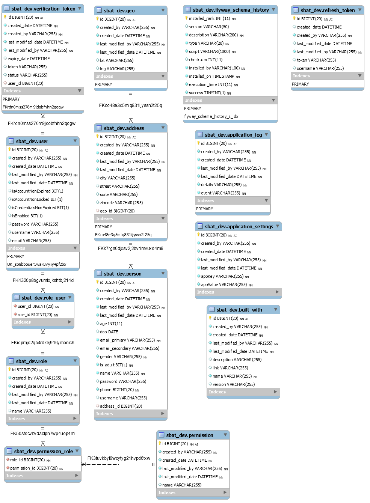

<!-- TABLE OF CONTENTS -->
## Table of Contents

<details open="open">
   <ul>
      <li><a href="#eer-diagram">EER Diagram</a></li>
      <li>
         <a href="#files-and-directories-structure">Files and Directories Structure</a>
         <ul>
            <li><a href="#project-structure">Project Structure</a></li>
            <li><a href="#packages">Packages</a></li>
         </ul>
      </li>
   </ul>
</details>

## EER Diagram

*	The authentication and authorization is governed by User and Role collection.  

[](images/settings/SBAT-EER-Diagram.png)

## Files and Directories Structure

The project (a.k.a. project directory) has a particular directory structure. A representative project is shown below:

### Project Structure

```text
.
├── Spring Elements
├── src
│   └── main
│       └── java
│           ├── io.github.anantharajuc.sbat
│           │ 
│           ├──io.github.anantharajuc.sbat.example.crm.admin.controllers
│           │  
│           ├──io.github.anantharajuc.sbat.example.crm.user.controllers
│           ├──io.github.anantharajuc.sbat.example.crm.user.model
│           ├──io.github.anantharajuc.sbat.example.crm.user.model.dto
│           ├──io.github.anantharajuc.sbat.example.crm.user.repositories
│           ├──io.github.anantharajuc.sbat.example.crm.user.services
│           │ 
│           ├──io.github.anantharajuc.sbat.core_backend.api
│           ├──io.github.anantharajuc.sbat.core_backend.api.rate_limiting
│           │ 
│           ├──io.github.anantharajuc.sbat.core_backend.config
│           ├──io.github.anantharajuc.sbat.core_backend.email
│           ├──io.github.anantharajuc.sbat.core_backend.exception
│           │     
│           ├──io.github.anantharajuc.sbat.core_backend.persistence.auditing
│           ├──io.github.anantharajuc.sbat.core_backend.persistence.model
│           ├──io.github.anantharajuc.sbat.core_backend.persistence.model.enumeration
│           ├──io.github.anantharajuc.sbat.core_backend.persistence.repositories
│           │
│           ├──io.github.anantharajuc.sbat.backend.persistence.security
│           ├──io.github.anantharajuc.sbat.backend.persistence.security.authentication
│           ├──io.github.anantharajuc.sbat.backend.persistence.security.authorization
│           ├──io.github.anantharajuc.sbat.backend.persistence.security.jwt
│           ├──io.github.anantharajuc.sbat.backend.persistence.security.jwt.model
│           ├──io.github.anantharajuc.sbat.backend.persistence.security.jwt.repository
│           ├──io.github.anantharajuc.sbat.backend.persistence.security.jwt.service
│           ├──io.github.anantharajuc.sbat.backend.persistence.security.user
│           ├──io.github.anantharajuc.sbat.backend.persistence.security.user.model
│           ├──io.github.anantharajuc.sbat.backend.persistence.security.user.repository
│           │
│           ├──io.github.anantharajuc.sbat.core_backend.service
│           ├──io.github.anantharajuc.sbat.core_backend.service.impl
│           │
│           ├──io.github.anantharajuc.sbat.core_backend.util
│           │
│           ├──io.github.anantharajuc.sbat.web.controllers
│           └──io.github.anantharajuc.sbat.web.domain.frontend
├── src
│   └── main
│       └── resources
│           ├── data
│           │   └── mysql
│           │       └── migrations
│           │           ├── V0_0_1__initialize_structure.sql
│           │           └── V0_0_2__audit_structure.sql
│           │           └── V0_0_3__populate_data.sql
│           │           └── V0_0_4__data_geo.sql
│           │           └── V0_0_5__data_address.sql
│           │           └── V0_0_6__data_person.sql
│           │           └── V0_0_7__data_security.sql
│           ├── i18n
│           │   └── messages.properties
│           │   └── messages_es.properties
│           ├── static
│           │   ├── css
│           │   ├── images
│           │   ├── js
│           │   └── favicon.ico
│           ├── templates
│           │   ├── fragments
│           │   │   ├── body_scripts.html
│           │   │   ├── footer.html
│           │   │   ├── htmlhead.html
│           │   │   ├── navigation.html
│           │   │   ├── pagetitle.html
│           │   │   └── social_buttons.html
│           │   │   
│           │   ├── pages
│           │   │   ├── about.html
│           │   │   ├── built_with.html
│           │   │   ├── close.html
│           │   │   ├── form.html
│           │   │   ├── index.html
│           │   │   ├── login.html
│           │   │   └── settings.html
│           │   │   
│           │   ├── error.html
│           │   ├── layout.html
│           │   └── mailTemplate.html
│           │   
│           ├── application-dev.properties
│           ├── application-production.properties
│           ├── application-qa.properties
│           ├── application-staging.properties
│           ├── application.properties
│           │  
│           ├── ebininfosoft-ssl-key
│           ├── redditclone.jks
│           │  
│           ├── banner.txt
│           │  
│           └── log4j2.xml
├── src
│   └── test
│       └── java/io/github/anantharajuc/sbtest/service
│           └── PersonServiceImpl.test
├── JRE System Library
├── Maven Dependencies
├── bin
├── logs
│   └── application.log
├── src
├── target
│   └──application-0.0.1-SNAPSHOT
├── mvnw
├── mvnw.cmd
├── pom.xml
│ 
├── .travis
│ 
├── CODE_OF_CONDUCT.md
├── CONTRIBUTING.md
├── LICENSE.md
└── README.md
```

### Packages

*   `api` - API utilities;
*   `rate_limiting` - API rate limiting;
*   `auditing` - data entity auditing;
* 	`authentication` - application user authentication;
* 	`configuration` - app configurations;
* 	`controllers` - to listen to the client;
* 	`exception` - to hold custom exception handling;
* 	`models` - to hold our entities;
* 	`repository` - to communicate with the database;
* 	`security` - security configuration;
* 	`jwt` - json web token for authentication;
* 	`service` - to hold business logic;
* 	`util` - to hold our utility classes;

* 	`resources/` - Contains all the static resources, templates and property files.
* 	`resources/data/mysql.migrations/` - Contains initial table structure & table data - used by flyway.
* 	`resources/static` - contains static resources such as css, js and images.
* 	`resources/templates` - contains server-side templates which are rendered by Spring.
* 	`resources/templates/fragments` - contains reusable code fragments.
* 	`resources/templates/pages` - contains server-side templates built using fragments.
* 	`resources/application.properties` - It contains application-wide properties. Spring reads the properties defined in this file to configure your application. You can define server’s default port, server’s context path, database URLs etc, in this file.

* 	`test/` - contains unit and integration tests

* 	`pom.xml` - contains all the project dependencies