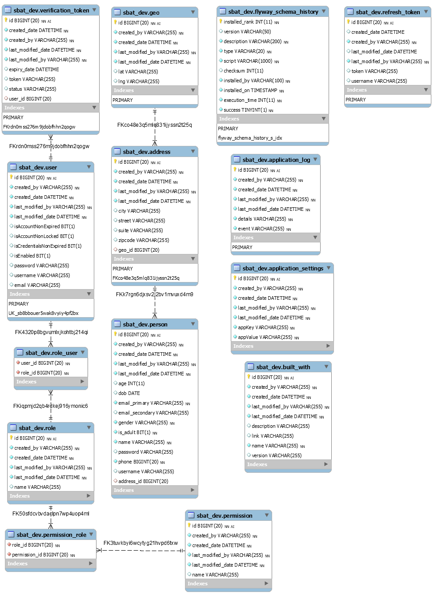

<!-- TABLE OF CONTENTS -->
## Table of Contents

<details open="open">
   <ul>
      <li><a href="#overview">Overview</a></li>
      <li><a href="#security">Security</a></li>
      <li><a href="#eer-diagram">EER Diagram</a></li>
      <li>
         <a href="#files-and-directories-structure">Files and Directories Structure</a>
         <ul>
            <li><a href="#project-structure">Project Structure</a></li>
            <li><a href="#packages">Packages</a></li>
         </ul>
      </li>
   </ul>
</details>

## Overview

A monolithic Spring Boot application that serves both a server-rendered web UI (Thymeleaf) and a REST API from the same process and database.

*	`core_backend` holds the reusable building blocks: security, persistence base classes, API utilities, e-mail and configuration. Keep it when you start your own project.
*	`example` is a sample domain (persons with addresses) showing controllers, services, repositories, DTOs, HATEOAS, caching and role based access. Delete it, or keep it as a reference.
*	`web` holds the controllers of the web UI pages.

Configuration is read from `application.properties` and the active profile's file; anything environment specific comes from environment variables or a `.env` file (see [Getting Started](GETTING_STARTED.MD)). Some application values (application name and version, token lifetimes, mail subject and sender) are stored in the `sbat_settings` table and loaded at startup by `OtherServicesImpl`.

## Security

`ApplicationSecurityConfiguration` defines two Spring Security filter chains:

| Chain | Paths | Authentication | Sessions | CSRF |
|-------|-------|----------------|----------|------|
| API | `/api/**`, `/rbac/**`, `/actuator/**` | JWT bearer token (OAuth2 resource server) or HTTP Basic | Stateless | Off |
| Web | everything else | Form login, remember-me | HTTP session | On |

*	`JwtConfiguration` provides the RSA key pair (from the configured key store, or generated at startup) and the `JwtEncoder` / `JwtDecoder`. `JwtProvider` issues access tokens.
*	`JwtUserAuthenticationConverter` turns a verified token into an authentication backed by the user's current database record, so roles, permissions and account status always come from the database.
*	`UserPrincipalService` loads users and rejects clients blocked by `LoginAttemptService`.
*	Method security (`@PreAuthorize`) on the controllers checks roles and permissions, see [User Roles](USER_ROLES.MD).

## EER Diagram

*	The authentication and authorization is governed by the User, Role and Permission tables.

[](images/settings/SBAT-EER-Diagram.png)

## Files and Directories Structure

### Project Structure

```text
.
├── .github
│   ├── workflows/build.yml                  GitHub Actions: build, test, Docker image
│   └── dependabot.yml                       Dependency updates (Maven, Actions, Docker)
├── .circleci/config.yml                     CircleCI build
├── .mvn/wrapper                             Maven wrapper
├── documents                                Documentation (this folder)
├── src
│   ├── main
│   │   ├── java
│   │   │   └── io.github.anantharajuc.sbat
│   │   │       ├── SBtemplateApplication.java
│   │   │       ├── core_backend
│   │   │       │   ├── api                              Resource paths, API header names
│   │   │       │   │   └── rate_limiting                Bucket4j rate limiting
│   │   │       │   ├── email                            Verification e-mails
│   │   │       │   ├── infra
│   │   │       │   │   ├── config                       Jackson, OpenAPI, i18n, MVC, ModelMapper configuration
│   │   │       │   │   └── exception                    Exceptions and the REST error handler
│   │   │       │   ├── monitoring                       Custom actuator endpoint
│   │   │       │   ├── persistence
│   │   │       │   │   ├── auditing                     JPA auditing (created/modified by and date)
│   │   │       │   │   ├── model                        Base entities, application settings, tech stack
│   │   │       │   │   └── repositories
│   │   │       │   ├── security                         Filter chains, security properties, JWT converter
│   │   │       │   │   ├── jwt                          Key pair, token issuing, refresh and verification tokens
│   │   │       │   │   └── user                         Users, roles, permissions
│   │   │       │   │       ├── authentication           Sign-up, login, verification, login throttling
│   │   │       │   │       └── authorization            RBAC user management API
│   │   │       │   ├── service                          Application settings, Postman Echo sample client
│   │   │       │   ├── user                             "Current user" API
│   │   │       │   └── util                             Site branding properties
│   │   │       ├── example.crm
│   │   │       │   ├── admin.controllers                Person management API (ADMIN, ADMINTRAINEE)
│   │   │       │   └── user                             Person API, model, DTOs, services, repository
│   │   │       └── web
│   │   │           ├── controllers                      Web UI pages, sample form, hello endpoints
│   │   │           └── domain.frontend                  Form backing objects
│   │   └── resources
│   │       ├── application.properties               Shared configuration
│   │       ├── application-<profile>.properties     test (H2), dev, qa, staging, production
│   │       ├── data
│   │       │   ├── h2db/migrations                  Flyway scripts for H2 (test profile)
│   │       │   └── mysql/migrations                 Flyway scripts for MySQL (other profiles)
│   │       ├── i18n                                 messages.properties, messages_es.properties
│   │       ├── static                               css, js, images, favicon.ico
│   │       ├── templates
│   │       │   ├── fragments                        Head, navigation, footer, scripts, ...
│   │       │   ├── pages                            Page templates
│   │       │   ├── layout.html                      Page layout (Thymeleaf Layout Dialect)
│   │       │   ├── error.html, 403.html
│   │       │   └── mailTemplate.html
│   │       └── banner.txt
│   └── test
│       └── java/io/github/anantharajuc/sbat
│           └── TestSBtemplateApplication.java   Integration tests
├── .env.example                             Template for a local, git-ignored .env file
├── Dockerfile                               Multi-stage image build
├── docker-compose.yml                       MySQL + application
├── mvnw, mvnw.cmd
├── pom.xml
├── CODE_OF_CONDUCT.md
├── CONTRIBUTING.md
├── LICENSE.md
└── README.md
```

### Packages

*   `api` - API utilities, resource paths;
*   `rate_limiting` - API rate limiting;
*   `auditing` - data entity auditing;
* 	`authentication` - sign-up, login, e-mail verification, login throttling;
* 	`authorization` - role based user management;
* 	`config` - app configurations;
* 	`controllers` - to listen to the client;
* 	`exception` - custom exceptions and REST error responses;
* 	`model` - to hold our entities;
* 	`repository` / `repositories` - to communicate with the database;
* 	`security` - security configuration;
* 	`jwt` - JSON Web Token signing keys, access, refresh and verification tokens;
* 	`service` - to hold business logic;
* 	`util` - to hold our utility classes;

* 	`resources/` - Contains all the static resources, templates and property files.
* 	`resources/data/*/migrations/` - Initial table structure and data, applied by Flyway.
* 	`resources/static` - contains static resources such as css, js and images.
* 	`resources/templates` - contains server-side templates which are rendered by Spring.
* 	`resources/templates/fragments` - contains reusable code fragments.
* 	`resources/templates/pages` - contains server-side templates built using fragments.
* 	`resources/application.properties` - application-wide properties: server port, session timeout, security, database, mail, actuator and more. Profile files override them.

* 	`test/` - contains the integration tests

* 	`pom.xml` - contains all the project dependencies
