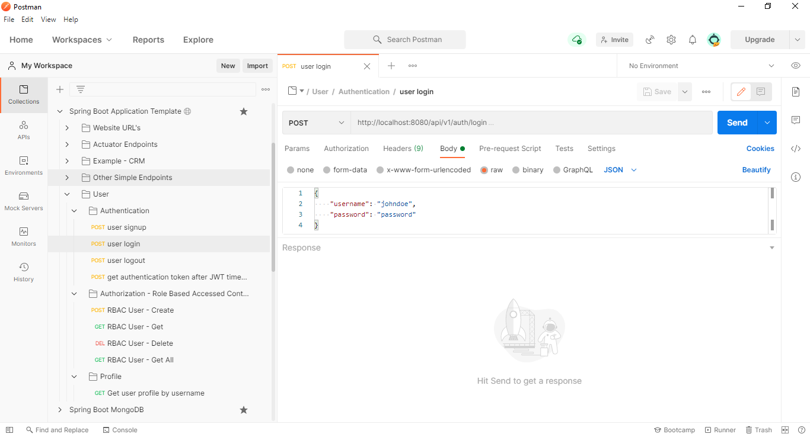

## Testing API

<details open="open">
	<ul>
		<li><a href="#testing-with-postman-runner">Testing with Postman Runner</a></li>
		<li><a href="#testing-with-maven">Testing with Maven</a></li>
		<li><a href="#basic-load-testing">Basic Load Testing</a></li>
	</ul>
</details>

### Testing with Postman 

You can test out your application by using a third-party tool called [Postman](https://www.postman.com/), this is a free app that you can download and you can view all the endpoints on the left and the API data on the right.

[](images/Postman.PNG)

In order to download the End Points for the application you can find this file located here:

`documents/Spring Boot Application Template.postman_collection`

### Testing with Postman Runner

Import the **Spring Boot Application Template API.postman_test_run** file into postman and run the API tests.

### Testing with Maven

*	Run only unit tests:

```shell
$ mvn clean test
```

### Basic Load Testing

Basic load testing for retrieving a `person` for a given `id` can be performed with the ApacheBench by executing the following command:

```shell
ab -n 10000 -c 100 -k http://localhost:8080/api/v1/person/1
```

* **-n 10000** is the number of requests to make
* **-c 100** is the number of concurrent requests to make at a time
* **-k** sends the **KeepAlive** header, which asks the web server to not shut down the connection after each request is done, but to instead keep reusing it

Result:

```
Benchmarking localhost (be patient)
Completed 1000 requests
Completed 2000 requests
Completed 3000 requests
Completed 4000 requests
Completed 5000 requests
Completed 6000 requests
Completed 7000 requests
Completed 8000 requests
Completed 9000 requests
Completed 10000 requests
Finished 10000 requests


Server Software:
Server Hostname:        localhost
Server Port:            8080

Document Path:          /api/v1/person/1
Document Length:        132 bytes

Concurrency Level:      100
Time taken for tests:   9.213 seconds
Complete requests:      10000
Failed requests:        0
Non-2xx responses:      10000
Keep-Alive requests:    0
Total transferred:      5330000 bytes
HTML transferred:       1320000 bytes
Requests per second:    1085.38 [#/sec] (mean)
Time per request:       92.133 [ms] (mean)
Time per request:       0.921 [ms] (mean, across all concurrent requests)
Transfer rate:          564.95 [Kbytes/sec] received

Connection Times (ms)
              min  mean[+/-sd] median   max
Connect:        0    1   1.1      1      49
Processing:    13   91  30.1     85     523
Waiting:        0   68  29.3     65     472
Total:         14   91  30.1     85     523

Percentage of the requests served within a certain time (ms)
  50%     85
  66%     95
  75%    101
  80%    105
  90%    119
  95%    136
  98%    176
  99%    223
 100%    523 (longest request)
```