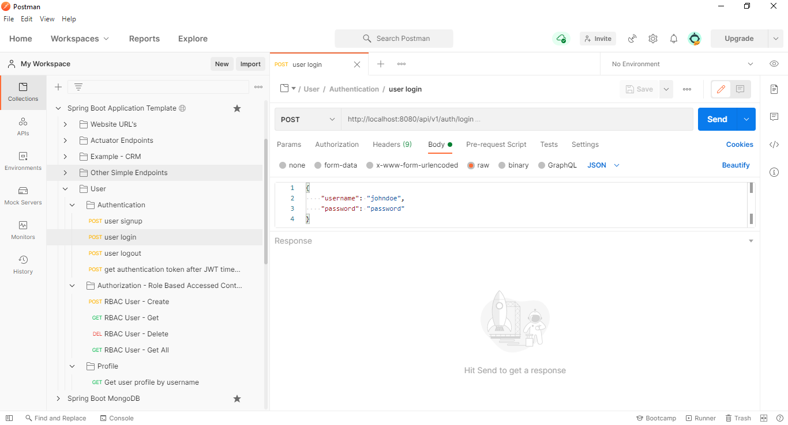

## Testing

<details open="open">
	<ul>
		<li><a href="#automated-tests">Automated tests</a></li>
		<li><a href="#testing-with-postman">Testing with Postman</a></li>
		<li><a href="#basic-load-testing">Basic load testing</a></li>
	</ul>
</details>

### Automated tests

```shell
./mvnw test      # run the tests
./mvnw verify    # run the tests and write the coverage report, see CODE_COVERAGE.MD
```

`src/test/java/io/github/anantharajuc/sbat/TestSBtemplateApplication.java` contains integration tests that start the whole application (`@SpringBootTest`) on the in-memory H2 database and call it through `MockMvc`. They cover:

*	**Web UI:** public pages, redirect to the login page, form login, rejection of a login without a CSRF token, admin-only pages.
*	**REST API:** missing and invalid tokens (401), role checks (403), admin access to RBAC and actuator endpoints, creating a user with a new role through `/rbac/user`.
*	**Tokens:** a refresh token cannot be used for another user, refresh tokens are rotated and single use.
*	**Login throttling:** a client IP is blocked after 5 failed logins while other clients are not.
*	**Account lifecycle:** sign-up validation, login only after e-mail verification, expired verification links remove only the unverified account.

Outgoing e-mail is replaced by a mock (`@MockitoBean JavaMailSender`), so no SMTP server is needed.

The same `./mvnw verify` runs in GitHub Actions on every push to `master` and every pull request (`.github/workflows/build.yml`), together with a Docker image build.

### Testing with Postman

You can try the API with [Postman](https://www.postman.com/). Import the collection from:

`documents/Spring Boot Application Template.postman_collection.json`

[](images/Postman.PNG)

To call protected endpoints, first send the **login** request, copy `authenticationToken` from the response and set it as the collection's **Bearer Token** (Authorization tab). Requests to `/api/v1/person/**` also need an `X-api-key` header, see [API rate limiting](API.md#api-rate-limiting).

The [Swagger UI](http://localhost:8080/swagger-ui.html) offers the same, without installing anything: click **Authorize** and paste the token.

### Basic load testing

Basic load testing for retrieving a `person` for a given `id` can be performed with ApacheBench. The endpoint needs a token and an API key, and is rate limited per API key (75 requests per 20 minutes at most), so measure against an endpoint without the rate limit, for example the management API with an admin token:

```shell
ab -n 10000 -c 100 -k -H "Authorization: Bearer $ACCESS_TOKEN" \
   http://localhost:8080/api/v1/management/person/id/1
```

* **-n 10000** is the number of requests to make
* **-c 100** is the number of concurrent requests to make at a time
* **-k** sends the **KeepAlive** header, which asks the web server to not shut down the connection after each request is done, but to instead keep reusing it
* **-H** adds a request header, here the access token

Access tokens are valid for 5 minutes by default (the `jwtExpirationTime` application setting), so get a fresh one right before the run.
