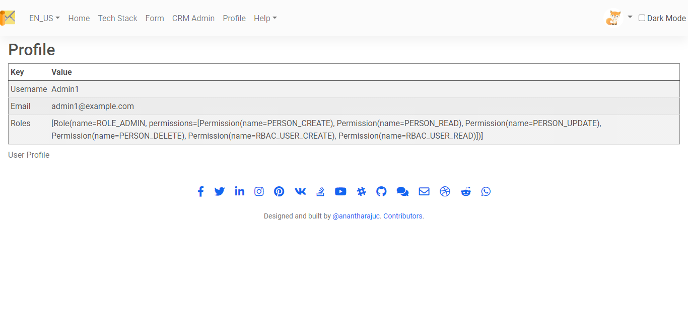

## User Profiles

### User Profile Page

Every user in your application will have a private profile page. By default the profile page is private, which means the profile is visible to the respective user only.

